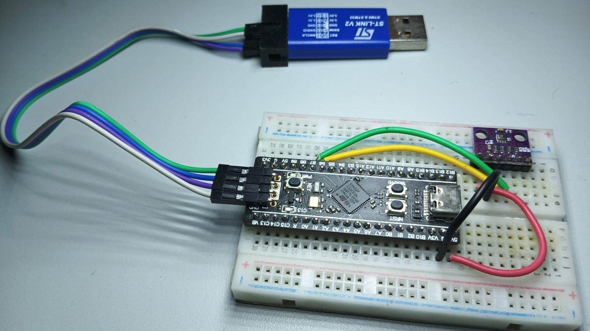

# BMP280-Scratch-I2C-Driver

<h3>This project is an implementation of an I2C driver from scratch using CMSIS headers.</h3>

<h2>Requirements :</h2>

* This repo is made to store my progress of implementing a bare metal i2c driver on the stm32 for a bmp280 sensor.
* Commit message convention is `DD/MM/YY_HH:MM - REMARKS`
* CHANGELOG.md contains mistakes, their solutions and learning.

### Hardware I am using:
* **Microcontroller :** STM32F411CUE6 (Black Pill).
* **Sensor :** BMP280 Sensor.
* **Debugger and Programmer :** ST-LINK V2 (or onboard ST-LINK)
* **Connecting wires and breadboard ** .
* Logic Analyzer

### Software:
* **[STM32CubeIDE](https://www.st.com/en/development-tools/stm32cubeide.html)** (v1.10.0 or higher recommended)

### Pinout
| BMP280 Pin | STM32 Pin | Description |
| :--- | :--- | :--- |
| **VCC** | 3.3V | Power Supply (3.3V) |
| **GND** | GND | Ground |
| **SCL / SCK** | PB6 (I2C1_SCL) | I2C Clock / SPI Clock |
| **SDA / SDI** | PB7 (I2C1_SDA) | I2C Data / SPI MOSI |

### Setup that I used:



## Getting started:

Follow these steps to clone, open, build, and run this project on your local setup.

### Step 1: Clone the Repository
Open your terminal or command prompt and clone the repository:

```bash
git clone https://github.com/ManaswiMukherjee/BMP280-Scratch-I2C-Driver
cd BMP280-Scratch-I2C-Driver
```

---

### Step 2: Import into STM32CubeIDE
1. Launch **STM32CubeIDE**.
2. Select your workspace directory and click **Launch**.
3. In the top menu, go to **File** -> **Import...**
4. Select **General** -> **Existing Projects into Workspace**, then click **Next**.
5. Choose **Select root directory**, click **Browse...**, and select the cloned `BMP280` project folder.
6. Make sure the project `BMP280` is checked in the list.
7. **Important:** Do **NOT** check *"Copy projects into workspace"* (keeping it unchecked ensures Git continues tracking your changes in place).
8. Click **Finish**.

---

### Step 3: Build the Project
1. In the **Project Explorer** window on the left, right-click on the `BMP280` project.
2. Select **Build Project** (or press `Ctrl + B`).
3. Ensure the build completes with **0 Errors**.

---

### Step 4: Flash and Debug
1. Connect your ST-LINK programmer to your PC and the STM32 board.
2. Click on the drop-down arrow next to the **Debug** button (bug icon) in the top toolbar.
3. Select **BMP280 Debug** (this uses the pre-configured `BMP280 Debug.launch` file).
4. Click **Resume** (green play button `F8`) to run the code.

---

## Modifying Hardware Configuration (Optional)

If you need to change pin assignments or peripheral clock settings through CubeMX   :
1. Double-click the **`BMP280.ioc`** file inside STM32CubeIDE to open **STM32CubeMX**.
2. Make your peripheral configuration changes.
3. Save the file (`Ctrl + S`) and click **Yes** when prompted to **"Generate Code"**.